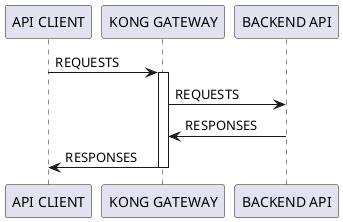
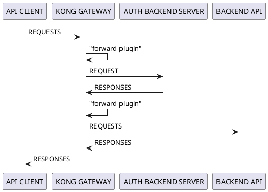
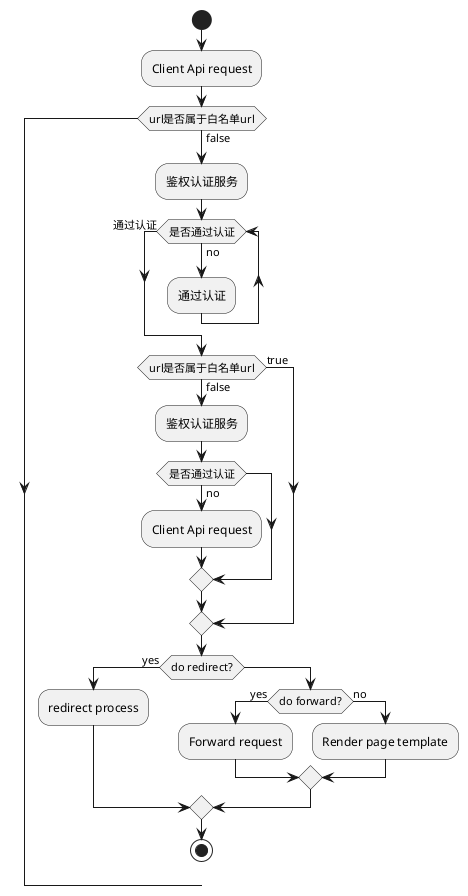

# kong网关
使用kong的kubernetes-ingress-controller来搭建属于我们的api网关服务
# kong简介
Kong Gateway是为微服务优化的开源，轻量级API网关
## Kong Gateway中的流量
默认情况下，Kong Gateway在其配置的代理端口8000和8443上侦听流量。它评估传入的客户端API请求，并将其路由到适当的后端API。在路由请求和提供响应时，可以根据需要通过插件应用策略。

例如，在路由请求之前，可能需要客户端进行身份验证。这带来了许多好处，包括：
* 由于Kong Gateway正在处理身份验证，因此该服务不需要自己的身份验证逻辑。
* 该服务仅接收有效请求，因此不会浪费周期来处理无效请求。
* 记录所有请求以集中查看流量。



### kong路由转发规则

## 转发时序图


## 转发逻辑

## 安装部署流程
本次步骤在kubernetes环境下部署，确保kubectl在v1.14版本以上
#### 部署kong
kubectl apply -k manifests/base
#### 运行两个测试服务

**构建服务镜像**
```bash
$docker build -t kong-test-app test-apps/
```
```bash
$docker build -t kong-test-auth test-apps/auth/
```
**在kubernetes环境跑起来**
```bash
$kubectl apply -f test-apps/test-app.yaml
```
```bash
$kubectl apply -f test-apps/auth/auth.yaml
```
**访问服务**
可以看到结果如下
```bash
[root@localhost kong-demo]# curl -i http://10.97.239.187/test/
HTTP/1.1 200 OK
Content-Type: text/plain; charset=utf-8
Content-Length: 6
Connection: keep-alive
Date: Wed, 29 Jul 2020 11:37:51 GMT
X-Kong-Upstream-Latency: 0
X-Kong-Proxy-Latency: 0
Via: kong/2.0.5

/test/
[root@localhost kong-demo]#
```
```bash
[root@localhost kong-demo]# curl -i http://10.97.239.187/auth/
HTTP/1.1 403 Forbidden
Content-Type: text/plain; charset=utf-8
Content-Length: 18
Connection: keep-alive
Date: Wed, 29 Jul 2020 11:42:52 GMT
X-Kong-Upstream-Latency: 1
X-Kong-Proxy-Latency: 0
Via: kong/2.0.5

username:, passwd:
[root@localhost kong-demo]#
```
#### 使用官方插件
在Ingress资源上配置官方插件
```bash
$ echo '
apiVersion: configuration.konghq.com/v1
kind: KongPlugin
metadata:
  name: add-response-header
config:
  add:
    headers:
    - "demo: injected-by-kong"
plugin: response-transformer
' | kubectl apply -f -
```
查看Ingress资源，可以看到刚刚创建的两个Ingress资源
```bash
[root@localhost kong-demo]# kubectl get ingress
NAME              HOSTS                 ADDRESS   PORTS   AGE
test-app-server   *                               80      6m31s
test-auth         *                               80      5m38s     13d
```

然后将其与Ingress规则相关联
```bash
$ kubectl patch ingress test-app-server -p '{"metadata":{"annotations":{"konghq.com/plugins":"add-response-header"}}}'
```
#### 安装自定义插件
**为插件代码创建ConfigMap或者Secret**
下面创建了3个自定义插件
```bash
kubectl create configmap kong-plugin-myheader --from-file=custom-plugins/myheader -n kong
```
```bash
kubectl create configmap kong-plugin-request-uri-pass-auth --from-file=custom-plugins/request-uri-pass-auth -n kong
```
```bash
kubectl create configmap kong-forward-auth-request --from-file=custom-plugins/forward-auth-request -n kong
```
**查看创建的configmap**
```bash
[root@localhost kong-demo]# kubectl get configmap -n kong
NAME                                DATA   AGE
ingress-controller-leader-kong      0      76m
kong-forward-auth-request           2      31s
kong-plugin-myheader                2      49s
kong-plugin-request-uri-pass-auth   2      36s
```
#### 更新kong Deployment资源
要使用自定义插件，新增custom-plugin.yaml文件，用于更新kong Deployment
```yaml
apiVersion: apps/v1
kind: Deployment
metadata:
  name: ingress-kong
  namespace: kong
spec:
  template:
    spec:
      containers:
      - name: proxy
        env:
        - name: KONG_PLUGINS
          value: request-uri-pass-auth,myheader,forward-auth-request
        - name: KONG_LUA_PACKAGE_PATH
          value: "/opt/?.lua;;"
        volumeMounts:
        - name: plugin-request-uri-pass-auth
          mountPath: /opt/kong/plugins/request-uri-pass-auth
        - name: my-custom-plugin
          mountPath: /opt/kong/plugins/myheader
        - name: forward-auth-request
          mountPath: /opt/kong/plugins/forward-auth-request
      volumes:
      - name: plugin-request-uri-pass-auth
        configMap:
          name: kong-plugin-request-uri-pass-auth
      - name: my-custom-plugin
        configMap:
          name: kong-plugin-myheader
      - name: forward-auth-request
        configMap:
          name: kong-forward-auth-request

```
**更新kong Deployment资源**
```bash
kubectl apply -k custom-plugins/
```
#### 创建KongPlugin自定义资源
分别对刚刚3个插件创建KongPlugin
```bash
[root@localhost kong-demo]# kubectl apply -f custom-plugins/myheader.yaml
kongplugin.configuration.konghq.com/my-custom-plugin created
```
```bash
[root@localhost kong-demo]# kubectl apply -f custom-plugins/request-uri-pass-auth.yaml
kongplugin.configuration.konghq.com/request-uri-pass-auth created
```
```bash
[root@localhost kong-demo]# kubectl apply -f custom-plugins/forward-auth-request.yaml
kongplugin.configuration.konghq.com/forward-auth-request created
```
**查看KongPlugin**
可以看到官方的KongPlugin和自定义KongPlugin
```bash
[root@localhost kong-demo]# kubectl get KongPlugin -A
NAMESPACE   NAME                    PLUGIN-TYPE             AGE
default     add-response-header     response-transformer    25m
default     forward-auth-request    forward-auth-request    31s
default     global-rate-limit       rate-limiting           18m
default     my-custom-plugin        myheader                98s
default     request-uri-pass-auth   request-uri-pass-auth   57s
```
## 测试
#### 查看kong代理服务IP
```bash
[root@localhost kong-demo]# kubectl get svc -n kong
NAME                      TYPE           CLUSTER-IP      EXTERNAL-IP   PORT(S)                      AGE
kong-proxy                LoadBalancer   10.106.111.87   <pending>     80:31777/TCP,443:30001/TCP   118m
kong-validation-webhook   ClusterIP      10.107.79.218   <none>        443/TCP                      118m
```
可以看到10.106.111.87是kong-proxy服务的ip，我们可以通过这个ip地址访问在ingress资源里暴露的服务
#### 测试自定义插件是否生效
```bash
[root@localhost kong-demo]# curl -i 10.106.111.87/test/
HTTP/1.1 401 Unauthorized
Date: Thu, 30 Jul 2020 10:01:56 GMT
Content-Type: application/json; charset=utf-8
Connection: keep-alive
Content-Length: 35
uri pass auth : true
myheader: my first plugin
X-Kong-Response-Latency: 0
Server: kong/2.0.5

{"message":"not access permission"}[root@localhost kong-demo]#
```
可以看到401状态码和返回结果{"message":"not access permission"}。这是转发插件+鉴权服务返回的结果。另外"uri pass auth : true"、"myheader: my first plugin"这两个头信息也是另外两个自定义插件设置的。说明所有自定义插件已经生效
> 注意！这里有一个坑。就是当使用自定义配置插件时，如果之前已经使用了官方插件，并且设置了全局生效。会造成kong-ingress-controller找不到ingress暴露出来的服务。

> 另外，使用了自定义插件，官方插件需要配置到kong Deployment资源清单KONG_PLUGINS里才能使用。